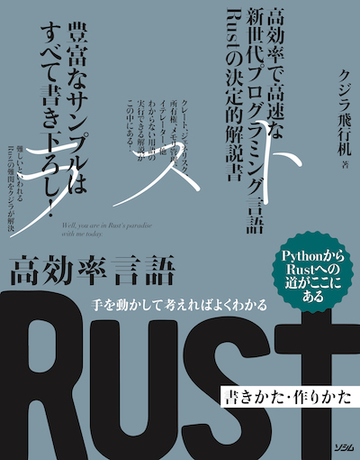

# 書籍『高効率言語 Rust 書き方・作り方』のサンプルプログラム

本リポジトリは、高効率で高速な新世代プログラミング言語Rustの決定的解説書の全サンプルです。本書に入りきらなかった特典(Appendix)も一緒にダウンロードできます。

## 書籍情報 - PythonからRustへの道がここにある！

- 書籍名: 高効率言語 Rust 書き方・作り方 - 手を動かして考えればよくわかる
- 出版社: ソシム (2022/1/21)
- 筆者: クジラ飛行机
- ページ数: 圧巻の560ページ
- ISBN-10: 4802613512 / ISBN-13: 978-4802613514
- [Amazonのリンク](https://amzn.to/3mnx9qe)

## 書籍の概要

多くのサンプルで、PythonとRustのプログラムを比較して、PythonプログラマーがRustに親しむことができるように配慮しています。難しいと言われるRustを気軽にはじめられる本です。

Rust学習の難所「所有権システム」も「ジェネリクス」も豊富なサンプルで楽々マスターしましょう。

### 目次

- ■Chapter 1 PythonからRustへ準備体操
- ■Chapter 2 Rustで簡単ツール作成編
- ■Chapter 3 - 文法編 - 所有権システムとデータ型について
- ■Chapter 4 - 文法編 - メソッド・ジェネリクス・トレイトについて
- ■Chapter 5 画像/音声/ネットワーク
- ■Chapter 6 - 応用編 - メモリ管理と他言語連携

本書のソースコード一式が src フォルダに入っています。

## 特典データ

特典PDFは apx フォルダに入っています。索引に、解決のヒント、用語集、基本構文まとめと盛りだくさんの特典です！！

- [本書の索引](apx/index.pdf) --- 560ページにおよぶ本書のどこに何が書かれているのか語句から該当ページを探すのに役立つ索引です。
- ``特典1``-[エラーメッセージと解決のヒント(appendix1.pdf)](apx/appendix1.pdf) --- Rustが動かない？その理由は？解決とヒントを紹介します。
- ``特典2``-[Rust用語集(appendix2.pdf)](apx/appendix2.pdf) --- 本書を読んでいて出てくる用語の解説集です。
- ``特典3``-[Rustの基本構文まとめ(appendix3.pdf)](apx/appendix3.pdf) --- Rustの基本的な構文の書式をまとめたものです。

書籍と一緒に特典データも楽しんでください。

